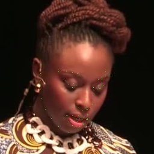
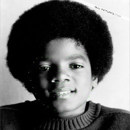

# face_alignement_FAN_tensorflow

This is an implementation in tensorflow 2.0 of: How far are we from solving the 2D & 3D Face Alignment problem? (and a
dataset of 230,000 3D facial landmarks) paper (https://github.com/1adrianb/face-alignment)

Please contact me if you are interested to get my weights. The scripts to train the depths networks and the FAN networks are provided. 
The weights for s3fd are provided

UPDATE: face-alignment is now accesible from Adrian Bullat directly from pip: pip install face-alignment

## Training:
```
  train_FAN_keras.py
  train_depths_keras.py
```
To change parameters, simply create your own json configuration file within "configs" or modify one of mine

## Prediction:
```
  predict_FAN_keras.py
```
The script also uses json configuration file where you can change the path to your images directly.

## Examples

 

# Aknowlegments
I thanks a lot Adrian Bulat and colleagues for this work. I have learned a lot by implementing this paper.
